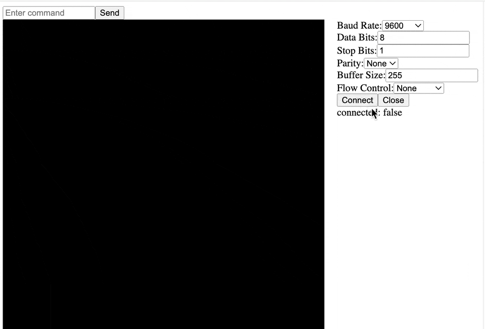

# Angular Serial Terminal
[](https://github.com/mattfors/ng-serial-terminal/actions/workflows/main.yml)


Web based serial terminal using Serial Web API, Angular and RxJS.

For a working demo: 

https://mattfors.github.io/ng-serial-terminal/




For an Arduino Sketch for testing:

https://github.com/mattfors/demo-serial-device

If you do not have a serial device you can test the terminal with a mocked version of the above sketch. Sent ``?`` for a list of commands:

https://mattfors.github.io/ng-serial-terminal/mock


## Checking out the project and serving locally

To check out the project and serve it locally, follow these steps:

1. Clone the repository:
    ```sh
    git clone https://github.com/mattfors/ng-serial-terminal.git
    cd ng-serial-terminal
    ```

2. Install the dependencies:
    ```sh
    npm install
    ```

3. Serve the application:
    ```sh
    ng serve
    ```

4. Open your browser and navigate to `http://localhost:4200/`.


## Serial Web API with RxJS and Angular 
First we need a way to transform the data stream into an observable. This is accomplished by creating a Subject and defining an UnderlyingSink which updates the Subject. NgZone must be called manually because the Streams API operates outside of Angular's zone, otherwise new data will not be trigger change detection  

```typescript
private dataSubject: Subject<string> = new Subject<string>();

private readonly sink: UnderlyingSink =  {
  write: (chunk: any) => {
    this.ngZone.run(() => {
      this.dataSubject.next(chunk);
    });
  }
}
``` 

Next we create a new writable stream and pipe to it from the serial port's readable. An abort controller is needed to stop the stream in order to close the port.
```typescript
this.abortController = new AbortController();
this.dataStream = new WritableStream(this.sink);
this.writer = this.port?.writable.getWriter();

return this.port.readable
    .pipeThrough(new TextDecoderStream())
    .pipeTo(this.dataStream, {signal: this.abortController.signal})
    .catch(() => this.closePort().catch((err) => observer.error(err)));
```

Finally, we have an observable of data chunks being read from the serial port.
```typescript
read(): Observable<string> {
  return this.dataSubject.asObservable();
}
```

Write to the port and get an observable which publishes when the write is complete.
```typescript
write(data: string): Observable<void> {
  if (this.writer) {
    return from(this.writer.write(new TextEncoder().encode(data)));

  }
  return throwError(() => new Error('No writer available.'));
} 
```
